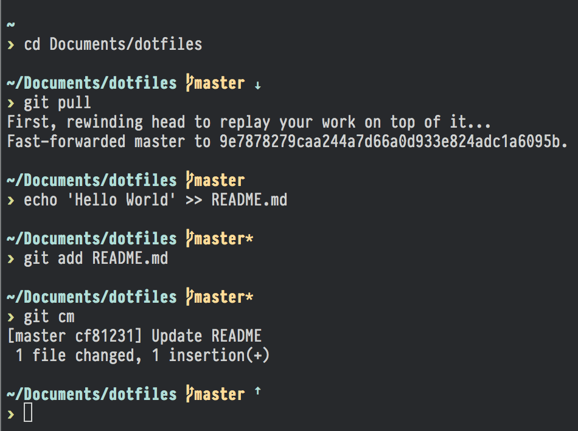
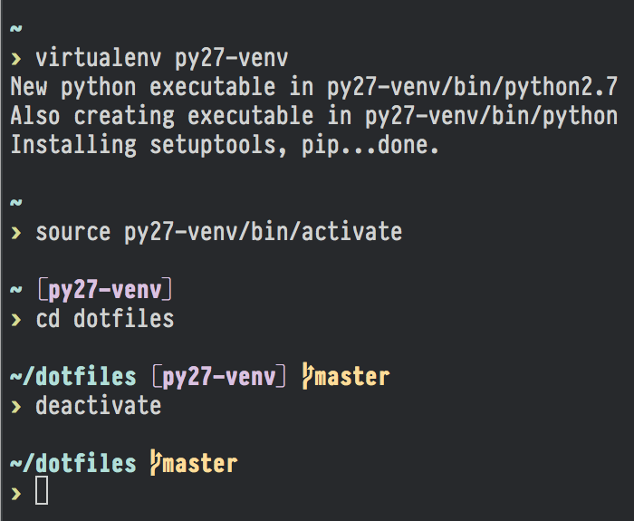

# blank
A theme for [Oh My Zsh](https://github.com/robbyrussell/oh-my-zsh) with Git, SSH and Virtualenv prompts.

## Screenshots
### Git prompt
Git branch, working tree status (*clean/dirty*) and locale/remote correlation (*ahead/behind*) are displayed.

### SSH prompt
While on SSH, user and hostname are displayed. If user is `root`, this part of prompt is colored significantly different.

### Virtualenv prompt
While on Python Virtualenv, `virtualenv` name is displayed.

## Prerequisites & Installation
You should have [Oh My Zsh](https://github.com/robbyrussell/oh-my-zsh) with `git` and `virtualenv` plugins enabled. To install,  
1. copy `blank.zsh-theme` to `~/.oh-my-zsh/custom`,  
2. add `ZSH_THEME=blank` to your `.zshrc`.

## Tips
1. Looks great with [PragmataPro](http://www.fsd.it/fonts/pragmatapro.htm) font.
2. You will probably enjoy a variety of color schemes calles [base16](http://chriskempson.github.io/base16).
3. If you do [dotfiles](http://dotfiles.github.io), you might add this repo as submodule and symlink `blank.zsh-theme` to `~/.oh-my-zsh/custom/blank.zsh-theme`.

## License
MIT © [Alexander Pyatkin](https://github.com/aspyatkin)

## Notes
1. The font on screenshots is [PragmataPro](http://www.fsd.it/fonts/pragmatapro.htm) by [Fabrizio Schiavi](http://www.fsd.it).
2. This project is inspired by the [pure](https://github.com/sindresorhus/pure) project. I used this theme for some time, but it has some issues on Windows machines, so I created the theme on my own.